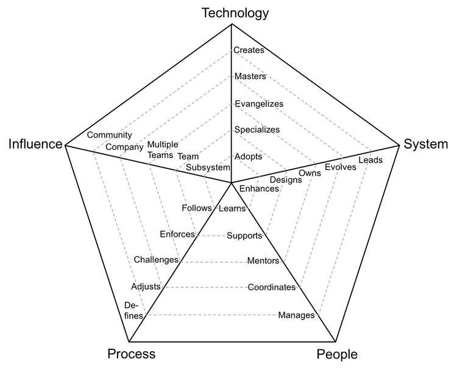

# 概要

フレームワークを利用することで、engineering managers は、各ポジションに期待されることや、キャリアラダーの次のレベルに到達するための計画について、メンバーと有意義な会話をすることができます。

フレームワークは、米国のテック企業ではある程度標準的な役割とレベルを使用していますが、すべての企業でそのまま利用できるわけではありません。ここにある情報をベースラインとして使用し必要に応じて柔軟に適用してください。

フレームワークは、レーダーチャートに大きく依存して、特定のポジションのさまざまな視点と期待を視覚的に示します。

<picture>
  <source media="(prefers-color-scheme: dark)" srcset="charts/template-dark.png">
  <source media="(prefers-color-scheme: light)" srcset="charts/template.png">
  
</picture>

# キャリアラダー

フレームワークには、４つの異なるラダーがあります:

* [**開発者**](Developer.md): プログラマーまたはソフトウェアエンジニアとしても知られる役割には、深いレベルの技術的専門知識が必要です。
* [**テックリード**](TechLead.md): 開発リーダーとしても知られる役割は、システムのオーナーであり、実践的な開発、アーキテクチャの知識、およびプロダクトのサポートの間で絶妙なバランスを必要とします。
* [**テクニカルプログラムマネージャー**](TechnicalProgramManager.md): 複数のチームにまたがる意思決定を調整し、完了に導く責任を負う役割。
* [**エンジニアマネージャー**](EngineeringManager.md): 開発マネージャーとしても知られる役割は、持続的なデリバリ、キャリアの成長、チームの幸福度に責任を負います。

もしも [テックリード](TechLead.md) と [エンジニアマネージャー](EngineeringManager.md) の違いについてピンと来ていない場合には、 [テックリード vs エンジニアマネージャー](TechLead-EngineeringManager.md) のページに詳細な比較が書かれているので参照してほしい。

| Level | Seniority | [開発者](Developer.md) | [テックリード](TechLead.md) | [テクニカルプログラムマネージャー](TechnicalProgramManager.md) | [エンジニアマネージャー](EngineeringManager.md) |
| :---: | :---: | :---: | :---: | :---: |  :---: |
| 1 | No | [D1](Developer.md#d1---developer-1) | | | |
| 2 | No | [D2](Developer.md#d2---developer-2) | | | |
| 3 | No | [D3](Developer.md#d3---developer-3) | | | |
| 4 | Yes | [D4](Developer.md#d4---developer-4) | [TL4](TechLead.md#tl4---tech-lead-4) | [TPM4](TechnicalProgramManager.md#tpm4---technical-program-manager-4) | |
| 5 | Yes | [D5](Developer.md#d5---developer-5) | [TL5](TechLead.md#tl5---tech-lead-5) | [TPM5](TechnicalProgramManager.md#tpm5---technical-program-manager-5) | [EM5](EngineeringManager.md#em5---engineering-manager-5) |
| 6 | Yes | [D6](Developer.md#d6---developer-6) | [TL6](TechLead.md#tl6---tech-lead-6) | [TPM6](TechnicalProgramManager.md#tpm6---technical-program-manager-6) | [EM6](EngineeringManager.md#em6---engineering-manager-6) |
| 7 | Yes | [D7](Developer.md#d7---developer-7) | [TL7](TechLead.md#tl7---tech-lead-7) | [TPM7](TechnicalProgramManager.md#tpm7---technical-program-manager-7) | [EM7](EngineeringManager.md#em7---engineering-manager-7) |

(詳細は役職名をクリックしてください)

# 軸

上記のチャートには、以下の5つの軸があります:
* **Technology**: 技術スタックとツールに関する知識
* **System**: システムに対するオーナーシップの度合い、レベル
* **People**: チームとの関係性
* **Process**: 開発プロセスへの関与のレベル
* **Influence**: 現状のポジションの影響範囲

`※図に表示された言葉なのであえて日本語に訳すことはしていないです`

**influence** 軸は、他と直交しておりすべての軸に適用されるため、*異なった次元* と見なすことができます。

各軸には、5 つの異なるレベルのパフォーマンスがあります。すべてのレベルに前のレベルが含まれていることが着目すべき重要な点です。たとえば、 Technology 軸で *evangelizes* を実行している人は、 *specializes*、*adopts* も行うことができることを表現しています。

各レベルの詳細は後述しています。

# Levels
`※図に表示された言葉なので各レベルや各軸ついては、あえて日本語に訳すことはしていないです`

## Technology

1. **Adopts**: チームによって決定されたテクノロジーとツールを積極的に学び、適応する。
2. **Specializes**: 1つまたは複数の技術領域において頼りになる人物であり、新しい技術を学ぶために率先して行動している。
3. **Evangelizes**: 調査、実証実験の実装、チームに新しいテクノロジーを導入する。
4. **Masters**: システムの技術スタック全体について非常に深い知識を持っている。
6. **Creates**: 内部または外部のチームによって広く使用されるような新しいテクノロジーを設計および作成する。

## System

1. **Enhances**: システムを改善および新機能とバグ修正を実行できる。
2. **Designs**: システムの技術的負債を削減しながら、中規模から大規模なサイズの機能の設計および実装をする。
4. **Owns**: システムの運用と監視を担当し、その SLA を気にしている。
5. **Evolves**: 将来の要件をサポートするためにアーキテクチャを進化、改善させ、SLA を定義する。
6. **Leads**: システムの技術的卓越性をリードし、停止を軽減するための計画を作成する。

## People

1. **Learns**: 他の人からすぐに学び、必要に応じて定常的にステップアップする。
2. **Supports**: 他のチームメンバーを積極的にサポートし、彼らが成功するのを助ける。
3. **Mentors**: 他の人がキャリア成長を加速できるようメンタリングを行、そのメンバーが力を発揮できるように導く。
4. **Coordinates**: チームメンバーの間に入り、効果的なフィードバックを提供したり、議論を円滑にする。
5. **Manages**: チームメンバーをマネージすることでキャリア、期待、パフォーマンス、幸福度に貢献する。

## Process

1. **Follows**: follows the team processes, delivering a consistent flow of features to production
2. **Enforces**: enforces the team processes, making sure everybody understands the benefits and tradeoffs
3. **Challenges**: challenges the team processes, looking for ways to improve them
4. **Adjusts**: adjusts the team processes, listening to feedback and guiding the team through the changes
5. **Defines**: defines the right processes for the team's maturity level, balancing agility and discipline

## Influence

1. **Subsystem**: makes an impact on one or more subsystems
2. **Team**: makes an impact on the whole team, not just on specific parts of it
3. **Multiple Teams**: makes an impact not only his/her team but also on other teams
4. **Company**: makes an impact on the whole tech organization
5. **Community**: makes an impact on the tech community

# FAQs

**What if some of the people don't meet all the points?**

That is very normal, people are usually stronger in some areas and weaker in others. The framework should not be used as a checklist to promote people but instead as guidance to have meaningful career conversations.

**What if my organization's career ladder is different?**

Since the framework is open source, you have the opportunity to adapt it to your organization. Feel free to use the [chart template](charts/template.png) to define your own levels.

**When is a person ready to move to the next level?**

Companies usually expect a person to be performing at the next level *consistently for several months* before formalizing a promotion.

**How do I collect evidence to support the discussion with my direct reports?**

Different teams collect evidence in different ways. A recommended approach is to use a combination of:
* 1:1 conversations
* Feedback from peers and other teams
* Self-evaluation

**Could the framework provide more specific examples of behavior to support each level?**

Specific examples of behavior require knowledge about the way that the team works, the system architecture and its technology stack. It is recommended to allow each team to define their own examples.

**Why does the framework stop at level 7?**

Levels 8 and above vary drastically from company to company. Organizations of different sizes tend to assign a diverse level of scope to positions so high in their structure.

**Do you have any additional resources about the topic?**

* [The Manager's Path](http://shop.oreilly.com/product/0636920056843.do): Camille Fournier does an excellent job at describing the expectations and challenges of many engineering positions. Also, she provides good advice about writing a career ladder in chapter 9.

* [How to Be Good at Performance Appraisals](https://store.hbr.org/product/how-to-be-good-at-performance-appraisals-simple-effective-done-right/10295): Dick Grote explains in simple terms how to define job responsibilities and how to evaluate performance (results and behaviors).

# Other Pages

* [**Developer**](Developer.md)
* [**Tech Lead**](TechLead.md)
* [**Technical Program Manager**](TechnicalProgramManager.md)
* [**Engineering Manager**](EngineeringManager.md)
* [**Tech Lead vs Engineering Manager**](TechLead-EngineeringManager.md)
* [**Managing Managers**](Managing-Managers.md)
